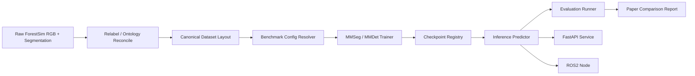

# VIS-FORESTSIM — Pipeline Map

## Goal

Turn the ForestSim paper and reference repository into an ANIMA module that can:

1. ingest the ForestSim dataset and reproduce the paper baselines,
2. run checkpointed inference on single images or streams,
3. expose the best model behind API, Docker, and ROS2 interfaces.

## Paper-To-Code Mapping

| Paper Component | Paper Ref | Reference Repo Artifact | ANIMA Target |
|----------------|-----------|-------------------------|--------------|
| synthetic data collection with Unreal Engine + AirSim | §IV-A to §IV-C | `scripts/car/*.py`, `scripts/multirotor/*.py`, `airsim_settings_json/` | documented provenance only; no MVP reimplementation |
| segmentation RGB consolidation | §IV-D | `tools/post_processing_code/ProcessSegmentation.py`, `rgb_ids.csv`, `LabelsWRGBS.csv` | `src/anima_vis_forestsim/data/relabel.py` |
| raw-to-sequential label encoding | §V | `tools/dataset_converters/forestsim_relabel_one_dim.py`, `forestsim_relabel6.py` | `src/anima_vis_forestsim/data/ontology.py` |
| random 90/10 split | §VI-B | `tools/dataset_converters/forestsim_train_test_split.py`, `splits/forestsim/*.txt` | `src/anima_vis_forestsim/data/splits.py` |
| dataset class registration | §V, §VI | `mmseg/datasets/forestsim.py`, `forestsim_group6.py` | `src/anima_vis_forestsim/datasets/*.py` |
| benchmark families | §VI-A | `configs/pspnet/`, `deeplabv3/`, `deeplabv3plus/`, `segformer/`, `mask2former/` | `src/anima_vis_forestsim/models/registry.py` + `configs/benchmarks/*.toml` |
| evaluation metrics and Table I reproduction | §VI-B to §VI-C | `tools/test.py`, `testresults/forestsim/**` | `src/anima_vis_forestsim/eval/runner.py` |
| visualization of predictions | Fig. 7, Fig. 8 | `mmseg/engine/hooks/visualization_hook.py` | `src/anima_vis_forestsim/infer/overlay.py` |
| best-model serving | Table I (`m11`, `m10`, `m13`, `m12`) | checkpoint/config pattern in repo | `src/anima_vis_forestsim/api/` and Docker assets |

## Canonical ANIMA Runtime Pipeline



## Canonical File Layout To Build

```text
src/anima_vis_forestsim/
├── config.py
├── device.py
├── version.py
├── data/
│   ├── ontology.py
│   ├── relabel.py
│   ├── splits.py
│   └── manifest.py
├── datasets/
│   ├── forestsim24.py
│   └── forestsim6.py
├── models/
│   ├── registry.py
│   ├── families.py
│   └── checkpoints.py
├── infer/
│   ├── predictor.py
│   ├── overlay.py
│   └── cli.py
├── eval/
│   ├── metrics.py
│   ├── runner.py
│   └── report.py
├── api/
│   ├── app.py
│   └── schemas.py
└── ros2/
    ├── node.py
    └── launch/
        └── forestsim.launch.py
```

## Tensor Contracts

| Stage | Tensor | Shape | Notes |
|------|--------|-------|-------|
| dataset sample | `image` | `[B, 3, 512, 512]` | RGB input after resize/crop |
| dataset sample | `label_24` | `[B, 512, 512]` | 24-class palette-index mask from repo converters |
| dataset sample | `label_6` | `[B, 512, 512]` | grouped traversability mask |
| segmentation logits | `logits` | `[B, C, 512, 512]` | `C=24` or `C=6` after decode/upscale |
| prediction | `pred_mask` | `[B, 512, 512]` | argmax class IDs |
| overlay | `overlay_rgb` | `[B, 512, 512, 3]` | visualization output |

## Benchmark Scope

### Required for paper-faithful reproduction
- PSPNet-R50
- DeepLabV3-R50
- DeepLabV3-R101
- DeepLabV3+-R50
- DeepLabV3+-R101
- SegFormer-B0
- SegFormer-B5
- Mask2Former-R50
- Mask2Former-R101
- Mask2Former-Swin-B
- Mask2Former-Swin-L
- Mask2Former-Swin-T
- Mask2Former-Swin-S

### Deferred beyond MVP
- Unreal/AirSim data recollection
- domain adaptation to real off-road data
- mixed-dataset and RUGD/Rellis transfer experiments

## Validation Sequence

1. Verify paper metadata, ontology, splits, and benchmark table against local PDF and repo.
2. Materialize canonical dataset manifests for raw, 24-class, and 6-class variants.
3. Reproduce the paper benchmark family configs with corrected class counts and naming.
4. Run deterministic evaluation and emit a `Table I` comparison report.
5. Package the selected checkpoint for API, Docker, and ROS2 consumers.
